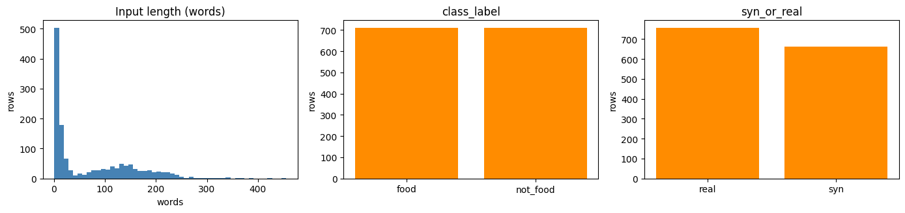
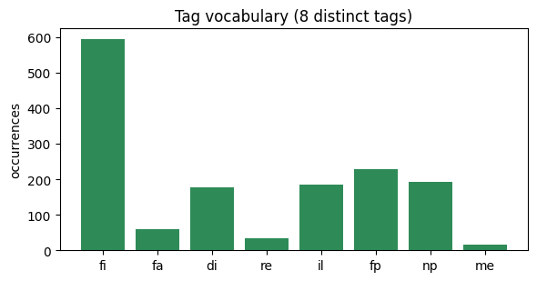
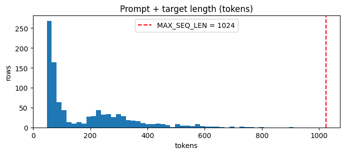

# QLoRA Domain Adaptation For JSON extraction

## Author: Niraj Thapaliya

## CSCI E-222 Final Project


Domain adaptation of a pretrained LLM via **QLoRA** fine-tuning for a structured-extraction task: `unstructured food text --> valid JSON`

| | |
|---|---|
| **Base model** | `Qwen/Qwen2.5-3B-Instruct` |
| **Dataset** | [`mrdbourke/FoodExtract-1k`](https://huggingface.co/datasets/mrdbourke/FoodExtract-1k) |
| **Method** | 4-bit NF4 quantization + LoRA adapters (QLoRA) |
| **Target hardware** | single 8 GB GPU (RTX 3060 Ti) or Colab |


The writeup is in the accompanying report. This is the code implementation. It
will have light comments but not detailed discussion.

## 0. Setup

`uv` is used for setup.

- First, download notebook to empty directory
- then run these commands:
```bash
uv python pin 3.14
uv init --bare
uv add transformers peft bitsandbytes accelerate datasets evaluate matplotlib pandas numpy
uv add --dev jupyter-lab
uv run jupyter lab
```


```python
import ast
import json
from collections import Counter
from pathlib import Path

import matplotlib.pyplot as plt
import numpy as np
import pandas as pd
import torch
from datasets import DatasetDict, load_dataset
from peft import LoraConfig, get_peft_model, prepare_model_for_kbit_training
from tqdm.auto import tqdm
from transformers import (
    AutoModelForCausalLM,
    AutoTokenizer,
    BitsAndBytesConfig,
    DataCollatorForSeq2Seq,
    Trainer,
    TrainingArguments,
)
```

    /home/ndthp/Projects/final_projects/e222/.venv/lib/python3.14/site-packages/tqdm/auto.py:21: TqdmWarning: IProgress not found. Please update jupyter and ipywidgets. See https://ipywidgets.readthedocs.io/en/stable/user_install.html
      from .autonotebook import tqdm as notebook_tqdm


```python
# dataset location
DATASET = "mrdbourke/FoodExtract-1k"
RAW_TARGET_COL = "gpt-oss-120b-label"
TARGET_COL = "target_json"
LABEL_KEYS = ("is_food_or_drink", "tags", "food_items", "drink_items")

# base model
MODEL_NAME = "Qwen/Qwen2.5-3B-Instruct"

# random seed for reproducibility
SEED = 222
torch.manual_seed(SEED)

MAX_SEQ_LEN = 1024

# Lora params
LORA_R = 16
LORA_ALPHA = 32
LORA_DROPOUT = 0.05
LORA_TARGETS = [
    "q_proj",
    "k_proj",
    "v_proj",
    "o_proj",
    "gate_proj",
    "up_proj",
    "down_proj",
]

# hyperparams
LEARNING_RATE = 2e-4
BATCH_SIZE = 1
GRAD_ACCUM = 16  # effective batch size = BATCH_SIZE * GRAD_ACCUM
NUM_EPOCHS = 3
LOGGING_STEPS = 10
WARMUP_STEPS = 10
OUTPUT_DIR = Path("qlora-foodextract-adapter")

# ---- device + tokenizer ----
DEVICE = "cuda" if torch.cuda.is_available() else "cpu"
print(f"device: {DEVICE}")
if DEVICE == "cuda":
    props = torch.cuda.get_device_properties(0)
    print(f"gpu   : {props.name}  ({props.total_memory / 1e9:.1f} GB)")

tokenizer = AutoTokenizer.from_pretrained(MODEL_NAME)
print(f"tokenizer: {MODEL_NAME}  (vocab size {tokenizer.vocab_size})")
```

    device: cuda
    gpu   : NVIDIA GeForce RTX 3060 Ti  (8.2 GB)


    Warning: You are sending unauthenticated requests to the HF Hub. Please set a HF_TOKEN to enable higher rate limits and faster downloads.


    tokenizer: Qwen/Qwen2.5-3B-Instruct  (vocab size 151643)


## 1. Explore the data


```python
raw = load_dataset(DATASET)
raw_train = raw["train"]
print(f"FoodExtract-1k split {list(raw)} has {raw_train.num_rows} rows")
# There is no validation/test split by default, we do that ourselves later
raw
```

    FoodExtract-1k split ['train'] has 1420 rows


    DatasetDict({
        train: Dataset({
            features: ['sequence', 'image_url', 'class_label', 'source', 'char_len', 'word_count', 'syn_or_real', 'uuid', 'gpt-oss-120b-label', 'gpt-oss-120b-label-condensed', 'target_food_names_to_use', 'caption_detail_level', 'num_foods', 'target_image_point_of_view'],
            num_rows: 1420
        })
    })


```python
print("Columns:")
for name, feat in raw_train.features.items():
    print(f"  {name:30s} {feat}")

# one row, example
for key, value in raw_train[0].items():
    text = repr(value)
    print(f"{key:30s} {text[:140]}{'...' if len(text) > 140 else ''}")
```

    Columns:
      sequence                       Value('string')
      image_url                      Value('string')
      class_label                    Value('string')
      source                         Value('string')
      char_len                       Value('float64')
      word_count                     Value('float64')
      syn_or_real                    Value('string')
      uuid                           Value('string')
      gpt-oss-120b-label             Value('string')
      gpt-oss-120b-label-condensed   Value('string')
      target_food_names_to_use       List(Value('string'))
      caption_detail_level           Value('string')
      num_foods                      Value('float64')
      target_image_point_of_view     Value('string')
    sequence                       'A mouth-watering photograph captures a delectable dish centered on a rectangular white porcelain plate, resting on a rustic wooden tabletop...
    image_url                      'http://i.imgur.com/X7cM9Df.jpg'
    class_label                    'food'
    source                         'pixmo_cap_dataset'
    char_len                       1028.0
    word_count                     160.0
    syn_or_real                    'real'
    uuid                           '6720d6e0-5912-41e7-be50-85a2b63bfef9'
    gpt-oss-120b-label             "{'is_food_or_drink': True, 'tags': ['fi', 'fa'], 'food_items': ['cheese-stuffed peppers', 'cherry tomato halves', 'green herbs', 'diced red...
    gpt-oss-120b-label-condensed   'food_or_drink: 1\ntags: fi, fa\nfoods: cheese-stuffed peppers, cherry tomato halves, green herbs, diced red onions, citrus-infused dressing...
    target_food_names_to_use       None
    caption_detail_level           None
    num_foods                      None
    target_image_point_of_view     None


### 1.1 The target column is not valid JSON

In the dataset, the actual 'gpt-oss-120b-label' is not strictly valid json, it's 
a python representation (`dict.to_string()`). Later we fix it so it's proper json.


```python
sample = raw_train[0][RAW_TARGET_COL]
print("raw target value:\n ", sample)
try:
    json.loads(sample)
except json.JSONDecodeError as err:
    print("\njson.loads(...) ->", err)

parsed = [ast.literal_eval(v) for v in raw_train[RAW_TARGET_COL]]
keysets = Counter(tuple(sorted(d)) for d in parsed)
print(f"\nast.literal_eval succeeds on {len(parsed)}/{raw_train.num_rows} rows")
print(f"distinct key-sets: {dict(keysets)}  -> schema is uniform")

# "is_food_or_drink" is usually a bool, sometimes the string 'true'/'false'
by_type = Counter(
    (type(d["is_food_or_drink"]).__name__, d["is_food_or_drink"]) for d in parsed
)
print("\nis_food_or_drink raw values, by (type, value):")
for (tname, val), count in by_type.most_common():
    print(f"  {tname:5s} {val!r:9} -> {count:4d} rows")
```

    raw target value:
      {'is_food_or_drink': True, 'tags': ['fi', 'fa'], 'food_items': ['cheese-stuffed peppers', 'cherry tomato halves', 'green herbs', 'diced red onions', 'citrus-infused dressing', 'oil', 'lime juice', 'cheese'], 'drink_items': []}
    
    json.loads(...) -> Expecting property name enclosed in double quotes: line 1 column 2 (char 1)
    
    ast.literal_eval succeeds on 1420/1420 rows
    distinct key-sets: {('drink_items', 'food_items', 'is_food_or_drink', 'tags'): 1420}  -> schema is uniform
    
    is_food_or_drink raw values, by (type, value):
      bool  False     ->  708 rows
      bool  True      ->  659 rows
      str   'false'   ->   45 rows
      str   'true'    ->    8 rows


### 1.2 Input and label distributions


```python
seq_chars = np.array([len(s) for s in raw_train["sequence"]])
seq_words = np.array([len(s.split()) for s in raw_train["sequence"]])
print(
    f"input length (chars): p50={np.percentile(seq_chars, 50):.0f}  "
    f"p90={np.percentile(seq_chars, 90):.0f}  p99={np.percentile(seq_chars, 99):.0f}  "
    f"max={seq_chars.max()}"
)
print(
    f"input length (words): p50={np.percentile(seq_words, 50):.0f}  "
    f"p90={np.percentile(seq_words, 90):.0f}  max={seq_words.max()}"
)

fig, axes = plt.subplots(1, 3, figsize=(14, 3.4))
axes[0].hist(seq_words, bins=50, color="steelblue")
axes[0].set(title="Input length (words)", xlabel="words", ylabel="rows")
for ax, col in zip(axes[1:], ["class_label", "syn_or_real"]):
    counts = Counter(raw_train[col])
    ax.bar(counts.keys(), counts.values(), color="darkorange")
    ax.set(title=col, ylabel="rows")
fig.tight_layout()
plt.show()

for col in ["class_label", "source", "syn_or_real"]:
    print(f"{col:13s} -> {dict(Counter(raw_train[col]))}")
```

    input length (chars): p50=138  p90=1200  p99=1805  max=2663
    input length (words): p50=23  p90=196  max=455


    

    


    class_label   -> {'food': 710, 'not_food': 710}
    source        -> {'pixmo_cap_dataset': 254, 'coyo700m_dataset': 261, 'gpt-oss-120b': 200, 'qwen2vl_open_dataset': 262, 'random-string-generation': 243, 'manual_taken_images': 200}
    syn_or_real   -> {'real': 757, 'syn': 663}


```python
# normalized target content
def _coerce_bool(v):
    return v.strip().lower() == "true" if isinstance(v, str) else bool(v)


is_food = [_coerce_bool(d["is_food_or_drink"]) for d in parsed]
tag_counts = Counter(t for d in parsed for t in (d["tags"] or []))
n_food = np.array([len(d["food_items"] or []) for d in parsed])
n_drink = np.array([len(d["drink_items"] or []) for d in parsed])

print(f"is_food_or_drink (normalized): {dict(Counter(is_food))}")
print(f"food_items per row : mean {n_food.mean():.1f}  max {n_food.max()}")
print(f"drink_items per row: mean {n_drink.mean():.1f}  max {n_drink.max()}")
empty = sum(1 for d in parsed if not d["food_items"] and not d["drink_items"])
print(f"rows with no food and no drink: {empty} ({empty / len(parsed):.0%})")

fig, ax = plt.subplots(figsize=(6, 3.2))
ax.bar(tag_counts.keys(), tag_counts.values(), color="seagreen")
ax.set(title=f"Tag vocabulary ({len(tag_counts)} distinct tags)", ylabel="occurrences")
fig.tight_layout()
plt.show()
```

    is_food_or_drink (normalized): {True: 667, False: 753}
    food_items per row : mean 3.3  max 43
    drink_items per row: mean 0.2  max 9
    rows with no food and no drink: 783 (55%)


    

    


### EDA summary:

- Single split, 1420 rows - need to split to train/test/val ourselves.
- Target needs cleaning - save and serialize to proper json
- Uniform 4-key schema - clean, checkable metrics (validity, schema, per-field F1).
- Only two columns matter for modeling: "sequence" (input) and the normalized target.
- Inputs are short - a `MAX_SEQ_LEN` of 1024 will fit nearly every example.
- Balanced labels - `class_label` is exactly 50/50 so we don't have to worry about class balancing

## 2. Preprocessing

Turn the raw dataset into tokenized, prompt-formatted training examples.


```python
# takes string representation of dict and makes it
# into a standard python dict after some cleaning
def parse_label(raw_value):
    d = ast.literal_eval(raw_value)
    is_fd = d.get("is_food_or_drink", False)
    return {
        "is_food_or_drink": is_fd.strip().lower() == "true"
        if isinstance(is_fd, str)
        else bool(is_fd),
        "tags": list(d.get("tags") or []),
        "food_items": list(d.get("food_items") or []),
        "drink_items": list(d.get("drink_items") or []),
    }


# json.dump
def to_json_target(raw_value):
    """Raw label -> canonical valid-JSON string (the supervised target)."""
    return json.dumps(parse_label(raw_value), ensure_ascii=False)


def is_valid_json(text):
    try:
        json.loads(text)
        return True
    except json.JSONDecodeError:
        return False


# before/after. notice the double quotes "" around keys and values
print("Before :", raw_train[0][RAW_TARGET_COL])
print("After  :", to_json_target(raw_train[0][RAW_TARGET_COL]))
```

    Before : {'is_food_or_drink': True, 'tags': ['fi', 'fa'], 'food_items': ['cheese-stuffed peppers', 'cherry tomato halves', 'green herbs', 'diced red onions', 'citrus-infused dressing', 'oil', 'lime juice', 'cheese'], 'drink_items': []}
    After  : {"is_food_or_drink": true, "tags": ["fi", "fa"], "food_items": ["cheese-stuffed peppers", "cherry tomato halves", "green herbs", "diced red onions", "citrus-infused dressing", "oil", "lime juice", "cheese"], "drink_items": []}


```python
def attach_target(row):
    row[TARGET_COL] = to_json_target(row[RAW_TARGET_COL])
    return row


full = raw_train.map(attach_target)

# make seeded 70/15/15 split
_holdout = full.train_test_split(test_size=0.30, seed=SEED)
_val_test = _holdout["test"].train_test_split(test_size=0.50, seed=SEED)
splits = DatasetDict(
    train=_holdout["train"],
    validation=_val_test["train"],
    test=_val_test["test"],
)

for name in splits:
    ds = splits[name]
    valid = sum(is_valid_json(t) for t in ds[TARGET_COL])
    balance = dict(Counter(ds["class_label"]))
    print(
        f"{name:11s} {ds.num_rows:4d} rows | target_json valid: {valid}/{ds.num_rows} | {balance}"
    )
```

    train        994 rows | target_json valid: 994/994 | {'not_food': 498, 'food': 496}
    validation   213 rows | target_json valid: 213/213 | {'not_food': 103, 'food': 110}
    test         213 rows | target_json valid: 213/213 | {'not_food': 109, 'food': 104}


### 2.1 Token-length analysis -> `MAX_SEQ_LEN`

Tokenize the full `system + input + target` sequence with the base model's tokenizer
to choose a `MAX_SEQ_LEN` that covers (nearly) every example without wasting compute.


```python
def _full_token_len(row):
    messages = [
        {"role": "system", "content": "Extract food and drink info as JSON."},
        {"role": "user", "content": row["sequence"]},
        {"role": "assistant", "content": row[TARGET_COL]},
    ]
    ids = tokenizer.apply_chat_template(messages, tokenize=True, return_dict=True)[
        "input_ids"
    ]
    return len(ids)


token_lens = np.array([_full_token_len(r) for r in splits["train"]])
print(
    f"prompt+target token length: p50={np.percentile(token_lens, 50):.0f}  "
    f"p90={np.percentile(token_lens, 90):.0f}  p99={np.percentile(token_lens, 99):.0f}  "
    f"max={token_lens.max()}"
)
for cap in (768, 1024, 1536):
    print(f"  MAX_SEQ_LEN={cap:5d} covers {(token_lens <= cap).mean():.1%} of rows")

fig, ax = plt.subplots(figsize=(7, 3.2))
ax.hist(token_lens, bins=50)
ax.axvline(MAX_SEQ_LEN, color="red", ls="--", label=f"MAX_SEQ_LEN = {MAX_SEQ_LEN}")
ax.set(title="Prompt + target length (tokens)", xlabel="tokens", ylabel="rows")
ax.legend()
fig.tight_layout()
plt.show()
```

    prompt+target token length: p50=101  p90=379  p99=641  max=911
      MAX_SEQ_LEN=  768 covers 99.8% of rows
      MAX_SEQ_LEN= 1024 covers 100.0% of rows
      MAX_SEQ_LEN= 1536 covers 100.0% of rows


    

    


### 2.2 Prompt formatting

Each example becomes a 3-turn chat: a fixed "system" instruction, the "user" text,
and the "assistant" JSON target. We use the tokenizer's chat template so the format
matches what `Qwen2.5-3B-Instruct` was trained on.


```python
SYSTEM_PROMPT = (
    "You extract food and drink information from text. "
    "Reply with exactly one JSON object and nothing else, with these keys: "
    '"is_food_or_drink" (boolean), "tags" (list of strings), '
    '"food_items" (list of strings), "drink_items" (list of strings).'
)


def build_messages(sequence, target_json=None):
    messages = [
        {"role": "system", "content": SYSTEM_PROMPT},
        {"role": "user", "content": sequence},
    ]
    if target_json is not None:
        messages.append({"role": "assistant", "content": target_json})
    return messages


example = splits["train"][0]
print(
    tokenizer.apply_chat_template(
        build_messages(example["sequence"], example[TARGET_COL]),
        tokenize=False,
    )
)
```

    <|im_start|>system
    You extract food and drink information from text. Reply with exactly one JSON object and nothing else, with these keys: "is_food_or_drink" (boolean), "tags" (list of strings), "food_items" (list of strings), "drink_items" (list of strings).<|im_end|>
    <|im_start|>user
    !!!!!!!!!!!!!!!!!!!!!!!!!!!!!!!!!!!!!.png<|im_end|>
    <|im_start|>assistant
    {"is_food_or_drink": false, "tags": [], "food_items": [], "drink_items": []}<|im_end|>
    


### 2.3 Tokenization with label masking

We train on the **completion only**: the prompt tokens (system + user) get label `-100`
so they are excluded from the loss, and the model is supervised purely on the JSON it
should generate.


```python
def tokenize_example(row):
    full_ids = tokenizer.apply_chat_template(
        build_messages(row["sequence"], row[TARGET_COL]),
        tokenize=True,
        return_dict=True,
    )["input_ids"]
    prompt_ids = tokenizer.apply_chat_template(
        build_messages(row["sequence"]),
        tokenize=True,
        return_dict=True,
        add_generation_prompt=True,
    )["input_ids"]

    full_ids = full_ids[:MAX_SEQ_LEN]
    labels = list(full_ids)
    for i in range(min(len(prompt_ids), len(full_ids))):
        labels[i] = -100  # mask the prompt -> loss only on the JSON target
    return {
        "input_ids": full_ids,
        "attention_mask": [1] * len(full_ids),
        "labels": labels,
    }


tokenized = splits.map(tokenize_example, remove_columns=splits["train"].column_names)

# sanity-check the masking on one example
ex = tokenized["train"][0]
supervised = [x for x in ex["labels"] if x != -100]
print(
    f"example 0: {len(ex['input_ids'])} tokens | "
    f"{len(supervised)} supervised (target), {len(ex['input_ids']) - len(supervised)} masked (prompt)"
)
print("\nsupervised span decodes to:")
print(" ", tokenizer.decode(supervised))
```

    example 0: 105 tokens | 26 supervised (target), 79 masked (prompt)
    
    supervised span decodes to:
      {"is_food_or_drink": false, "tags": [], "food_items": [], "drink_items": []}<|im_end|>
    


## 3. Model — QLoRA setup

QLoRA => load the base model with **4-bit NF4 quantization** (frozen), then train small
LoRA adapter matrices in higher precision on top. The 3B base shrinks to ~2 GB, so the
whole thing fits on an 8 GB GPU.


```python
bnb_config = BitsAndBytesConfig(
    load_in_4bit=True,
    bnb_4bit_quant_type="nf4",
    bnb_4bit_compute_dtype=torch.bfloat16,
    bnb_4bit_use_double_quant=True,
)

model = AutoModelForCausalLM.from_pretrained(
    MODEL_NAME,
    quantization_config=bnb_config,
    device_map=0,
    dtype=torch.bfloat16,
)
model.config.use_cache = False

model.config.pad_token_id = tokenizer.pad_token_id
model.generation_config.pad_token_id = tokenizer.pad_token_id

# greedy decoding only
model.generation_config.do_sample = False
model.generation_config.temperature = None
model.generation_config.top_p = None
model.generation_config.top_k = None

print(
    f"loaded {MODEL_NAME} in 4-bit | footprint: {model.get_memory_footprint() / 1e9:.2f} GB"
)
```

    Loading weights:   0%|          | 1/434 [00:00<01:25,  5.04it/s]/home/ndthp/Projects/final_projects/e222/.venv/lib/python3.14/site-packages/bitsandbytes/backends/cuda/ops.py:213: FutureWarning: _check_is_size will be removed in a future PyTorch release along with guard_size_oblivious.     Use _check(i >= 0) instead.
      torch._check_is_size(blocksize)
    Loading weights: 100%|██████████| 434/434 [00:01<00:00, 417.95it/s]


    loaded Qwen/Qwen2.5-3B-Instruct in 4-bit | footprint: 2.01 GB


```python
model = prepare_model_for_kbit_training(
    model,
    use_gradient_checkpointing=True,
    gradient_checkpointing_kwargs={"use_reentrant": False},
)

lora_config = LoraConfig(
    r=LORA_R,
    lora_alpha=LORA_ALPHA,
    lora_dropout=LORA_DROPOUT,
    target_modules=LORA_TARGETS,
    bias="none",
    task_type="CAUSAL_LM",
)
model = get_peft_model(model, lora_config)
model.print_trainable_parameters()
```

    trainable params: 29,933,568 || all params: 3,115,872,256 || trainable%: 0.9607


## 4. Evaluation harness

The model's job is structured extraction, so we score it on:

- json_valid: fraction of outputs that parse as JSON
- schema_ok: parse *and* have exactly the 4 keys with the right types
- is_food_acc: accuracy on the `is_food_or_drink` boolean
- tags_f1, food_items_f1, drink_items_f1: set-level F1 per list field
- exact_match: prediction equals the gold JSON exactly


```python
def extract_json(text):
    # try to get the first JSON object out of a model's raw output
    text = text.strip()
    if "```" in text:  # strip ``` / ```json fences
        parts = text.split("```")
        if len(parts) >= 3:
            text = parts[1]
            if text.startswith("json"):
                text = text[4:]
            text = text.strip()
    try:
        obj = json.loads(text)
        if isinstance(obj, dict):
            return obj
    except json.JSONDecodeError:
        pass
    start = text.find("{")  # otherwise look for first '{'
    if start == -1:
        return None
    depth = 0
    for i in range(start, len(text)):
        if text[i] == "{":
            depth += 1
        elif text[i] == "}":
            depth -= 1
            if depth == 0:
                try:
                    obj = json.loads(text[start : i + 1])
                    return obj if isinstance(obj, dict) else None
                except json.JSONDecodeError:
                    return None
    return None


# metrics
def f1_set(pred_items, gold_items):
    if not isinstance(pred_items, list):
        pred_items = []
    pred = {str(x).strip().lower() for x in pred_items}
    gold = {str(x).strip().lower() for x in gold_items}
    if not pred and not gold:
        return 1.0
    if not pred or not gold:
        return 0.0
    tp = len(pred & gold)
    if tp == 0:
        return 0.0
    precision, recall = tp / len(pred), tp / len(gold)
    return 2 * precision * recall / (precision + recall)
```


```python
def score_predictions(raw_preds, actual_jsons):
    # raw model outputs vs. actual
    n = len(raw_preds)
    totals = {
        "json_valid": 0,
        "schema_ok": 0,
        "is_food_acc": 0,
        "tags_f1": 0.0,
        "food_items_f1": 0.0,
        "drink_items_f1": 0.0,
        "exact_match": 0,
    }
    for raw, actual_json in zip(raw_preds, actual_jsons):
        actual = json.loads(actual_json)
        pred = extract_json(raw)
        if pred is None:
            continue
        totals["json_valid"] += 1
        typed_ok = (
            set(pred) == set(LABEL_KEYS)
            and isinstance(pred.get("is_food_or_drink"), bool)
            and all(
                isinstance(pred.get(k), list)
                for k in ("tags", "food_items", "drink_items")
            )
        )
        totals["schema_ok"] += int(typed_ok)
        if pred.get("is_food_or_drink") == actual["is_food_or_drink"]:
            totals["is_food_acc"] += 1
        totals["tags_f1"] += f1_set(pred.get("tags"), actual["tags"])
        totals["food_items_f1"] += f1_set(pred.get("food_items"), actual["food_items"])
        totals["drink_items_f1"] += f1_set(
            pred.get("drink_items"), actual["drink_items"]
        )
        if json.dumps(pred, sort_keys=True) == json.dumps(actual, sort_keys=True):
            totals["exact_match"] += 1
    return {k: v / n for k, v in totals.items()}
```


```python
@torch.no_grad()
def generate_json(model, sequence, max_new_tokens=320):
    # model.generate using greedy decoding (do_sample=False)
    inputs = tokenizer.apply_chat_template(
        build_messages(sequence),
        tokenize=True,
        add_generation_prompt=True,
        return_dict=True,
        return_tensors="pt",
    ).to(DEVICE)
    out_ids = model.generate(
        **inputs,
        max_new_tokens=max_new_tokens,
        do_sample=False,
        use_cache=True,
        pad_token_id=tokenizer.pad_token_id,
    )
    new_ids = out_ids[0, inputs["input_ids"].shape[1] :]
    return tokenizer.decode(new_ids, skip_special_tokens=True)


# final evaluate function
def evaluate_model(model, dataset, label="eval"):
    model.eval()
    raw_preds = [
        generate_json(model, ex["sequence"]) for ex in tqdm(dataset, desc=label)
    ]
    metrics = score_predictions(raw_preds, list(dataset[TARGET_COL]))
    return metrics, raw_preds
```

## 5. Take a baseline before fine-tuning

Score the base model with without LORA adapters. This is the "before" number
the fine-tuned model has to beat.


```python
test_eval = splits["test"]
print(f"evaluating on {len(test_eval)} test examples")

with model.disable_adapter():
    baseline_metrics, baseline_preds = evaluate_model(
        model, test_eval, label="baseline"
    )

print()
for key, value in baseline_metrics.items():
    print(f"  {key:16s} {value:.3f}")
print("\nexample baseline output:\n ", baseline_preds[0])
```

    evaluating on 213 test examples


    baseline:   0%|          | 0/213 [00:00<?, ?it/s]/home/ndthp/Projects/final_projects/e222/.venv/lib/python3.14/site-packages/bitsandbytes/backends/cuda/ops.py:468: FutureWarning: _check_is_size will be removed in a future PyTorch release along with guard_size_oblivious.     Use _check(i >= 0) instead.
      torch._check_is_size(blocksize)
    baseline: 100%|██████████| 213/213 [10:50<00:00,  3.06s/it]

    
      json_valid       0.972
      schema_ok        0.925
      is_food_acc      0.798
      tags_f1          0.305
      food_items_f1    0.667
      drink_items_f1   0.879
      exact_match      0.258
    
    example baseline output:
      {
      "is_food_or_drink": false,
      "tags": [
        "teenage",
        "boy",
        "short hair",
        "dark hair",
     forget-me-not",
        "t-shirt",
        "jeans",
        "tennis shoes",
        "computer",
        "office chair",
        "relaxed posture",
        "over-ear headphones",
        "blue circular detail",
        "water trickling",
        "skyscrapers",
        "dimly lit room",
        "rainy scene",
        "plant",
        "pictures",
        "red heart",
        "red dot"
      ],
      "food_items": [],
      "drink_items": []
    }


    


## 6. Fine-tuning


```python
train_ds = tokenized["train"]
eval_ds = tokenized["validation"]
print(f"train on {len(train_ds)} examples, validate on {len(eval_ds)}")

collator = DataCollatorForSeq2Seq(
    tokenizer,
    model=model,
    padding="longest",
    label_pad_token_id=-100,
)

training_args = TrainingArguments(
    output_dir=str(OUTPUT_DIR),
    num_train_epochs=NUM_EPOCHS,
    per_device_train_batch_size=BATCH_SIZE,
    per_device_eval_batch_size=BATCH_SIZE,
    gradient_accumulation_steps=GRAD_ACCUM,
    learning_rate=LEARNING_RATE,
    warmup_steps=WARMUP_STEPS,
    lr_scheduler_type="cosine",
    bf16=True,
    optim="paged_adamw_8bit",
    logging_steps=LOGGING_STEPS,
    eval_strategy="epoch",
    save_strategy="epoch",
    save_total_limit=1,
    report_to="none",
    seed=SEED,
)

trainer = Trainer(
    model=model,
    args=training_args,
    train_dataset=train_ds,
    eval_dataset=eval_ds,
    data_collator=collator,
    processing_class=tokenizer,
)
```

    train on 994 examples, validate on 213


```python
train_result = trainer.train()
for key, value in train_result.metrics.items():
    print(f"  {key:24s} {value}")
```

    [transformers] The tokenizer has new PAD/BOS/EOS tokens that differ from the model config and generation config. The model config and generation config were aligned accordingly, being updated with the tokenizer's values. Updated tokens: {'bos_token_id': None}.


    <div>

      <progress value='189' max='189' style='width:300px; height:20px; vertical-align: middle;'></progress>
      [189/189 22:39, Epoch 3/3]
    </div>
    <table border="1" class="dataframe">
  <thead>
 <tr style="text-align: left;">
      <th>Epoch</th>
      <th>Training Loss</th>
      <th>Validation Loss</th>
    </tr>
  </thead>
  <tbody>
    <tr>
      <td>1</td>
      <td>0.109920</td>
      <td>0.071709</td>
    </tr>
    <tr>
      <td>2</td>
      <td>0.066956</td>
      <td>0.061895</td>
    </tr>
    <tr>
      <td>3</td>
      <td>0.029739</td>
      <td>0.062998</td>
    </tr>
  </tbody>
</table><p>


      train_runtime            1366.3192
      train_samples_per_second 2.183
      train_steps_per_second   0.138
      total_flos               1.161880862404608e+16
      train_loss               0.09076674116982354
      epoch                    3.0


## 7. After fine-tuning

Evaluate the base model and the fine-tuned model and compare


```python
finetuned_metrics, finetuned_preds = evaluate_model(
    model, test_eval, label="fine-tuned"
)

comparison = pd.DataFrame(
    {"baseline": baseline_metrics, "fine-tuned": finetuned_metrics}
)
comparison["delta"] = comparison["fine-tuned"] - comparison["baseline"]
comparison.round(3)
```

    fine-tuned:   0%|          | 0/213 [00:00<?, ?it/s]/home/ndthp/Projects/final_projects/e222/.venv/lib/python3.14/site-packages/bitsandbytes/backends/cuda/ops.py:468: FutureWarning: _check_is_size will be removed in a future PyTorch release along with guard_size_oblivious.     Use _check(i >= 0) instead.
      torch._check_is_size(blocksize)
    fine-tuned: 100%|██████████| 213/213 [10:48<00:00,  3.04s/it]


<div>
<style scoped>
    .dataframe tbody tr th:only-of-type {
        vertical-align: middle;
    }

    .dataframe tbody tr th {
        vertical-align: top;
    }

    .dataframe thead th {
        text-align: right;
    }
</style>
<table border="1" class="dataframe">
  <thead>
    <tr style="text-align: right;">
      <th></th>
      <th>baseline</th>
      <th>fine-tuned</th>
      <th>delta</th>
    </tr>
  </thead>
  <tbody>
    <tr>
      <th>json_valid</th>
      <td>0.972</td>
      <td>1.000</td>
      <td>0.028</td>
    </tr>
    <tr>
      <th>schema_ok</th>
      <td>0.925</td>
      <td>1.000</td>
      <td>0.075</td>
    </tr>
    <tr>
      <th>is_food_acc</th>
      <td>0.798</td>
      <td>0.972</td>
      <td>0.174</td>
    </tr>
    <tr>
      <th>tags_f1</th>
      <td>0.305</td>
      <td>0.943</td>
      <td>0.637</td>
    </tr>
    <tr>
      <th>food_items_f1</th>
      <td>0.667</td>
      <td>0.867</td>
      <td>0.200</td>
    </tr>
    <tr>
      <th>drink_items_f1</th>
      <td>0.879</td>
      <td>0.959</td>
      <td>0.079</td>
    </tr>
    <tr>
      <th>exact_match</th>
      <td>0.258</td>
      <td>0.624</td>
      <td>0.366</td>
    </tr>
  </tbody>
</table>
</div>


## 8. Saving the adapter


```python
OUTPUT_DIR.mkdir(parents=True, exist_ok=True)
model.save_pretrained(OUTPUT_DIR)
tokenizer.save_pretrained(OUTPUT_DIR)
saved = sorted(p.name for p in OUTPUT_DIR.iterdir())
print(f"saved LoRA adapter + tokenizer to {OUTPUT_DIR.resolve()}")
print("contents:", saved)
```

    saved LoRA adapter + tokenizer to /home/ndthp/Projects/final_projects/e222/qlora-foodextract-adapter
    contents: ['README.md', 'adapter_config.json', 'adapter_model.safetensors', 'chat_template.jinja', 'checkpoint-189', 'tokenizer.json', 'tokenizer_config.json']


```python
for ex in splits["test"].select(range(3)):
    prediction = generate_json(model, ex["sequence"])
    print("INPUT :", ex["sequence"][:200].replace("\n", " "), "...")
    print("GOLD  :", ex[TARGET_COL])
    print("PRED  :", prediction)
    print("-" * 90)
```

    /home/ndthp/Projects/final_projects/e222/.venv/lib/python3.14/site-packages/bitsandbytes/backends/cuda/ops.py:468: FutureWarning: _check_is_size will be removed in a future PyTorch release along with guard_size_oblivious.     Use _check(i >= 0) instead.
      torch._check_is_size(blocksize)


    INPUT : The image depicts a teenage boy with short dark hair, sitting cozily in a black office chair at a slight angle, likely engaged with a computer or desk in front of him, though the object is cut off fro ...
    GOLD  : {"is_food_or_drink": false, "tags": [], "food_items": [], "drink_items": []}
    PRED  : {"is_food_or_drink": false, "tags": [], "food_items": [], "drink_items": []}
    ------------------------------------------------------------------------------------------
    INPUT : groom a dog with long hair ...
    GOLD  : {"is_food_or_drink": false, "tags": [], "food_items": [], "drink_items": []}
    PRED  : {"is_food_or_drink": false, "tags": [], "food_items": [], "drink_items": []}
    ------------------------------------------------------------------------------------------
    INPUT : A top‑down view of a white plate displaying cauliflower florets, a pinch of baking soda, pieces of rocky road, assorted sushi, sweet potato wedges, mushroom flatbreads, a drizzle of pesto sauce, jujub ...
    GOLD  : {"is_food_or_drink": true, "tags": ["fi", "di"], "food_items": ["cauliflower florets", "baking soda", "rocky road", "sushi", "sweet potato wedges", "mushroom flatbreads", "pesto sauce", "jujube fruits", "raw beef brisket"], "drink_items": ["white wine"]}
    PRED  : {"is_food_or_drink": true, "tags": ["fi", "di"], "food_items": ["cauliflower florets", "baking soda", "rocky road", "sushi", "sweet potato wedges", "mushroom flatbreads", "pesto sauce", "jujube fruits", "raw beef brisket"], "drink_items": ["white wine"]}
    ------------------------------------------------------------------------------------------


## Summary

- Data pipeline: Normalized strings to valid JSON targets
- Created data splits
- Formatted input text and tokenize
- Loaded model and attach LoRA adapters
- Run the supervised fine tuning
- Evaluated the base model and fine-tuned model and compared 

## Next Steps

Further investigate squeezing larger models on 8GB of VRAM.
- iterate over different hyperparams: LoRA rank / `target_modules` and compare quality vs. trainable-parameter count
- compare 4-bit QLoRA against 8-bit and against full LoRA and measure memory, speed, and quality of each
- try a smaller (`Qwen2.5-1.5B`) and larger (`Qwen2.5-7B`) base under the same 8 GB budget

Total time to run this notebook: ~45 minutes
